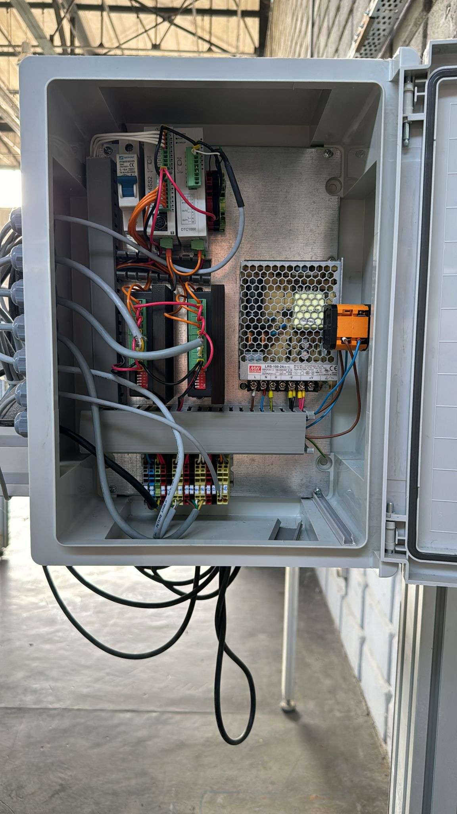
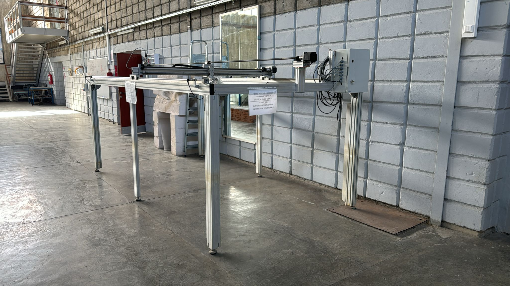
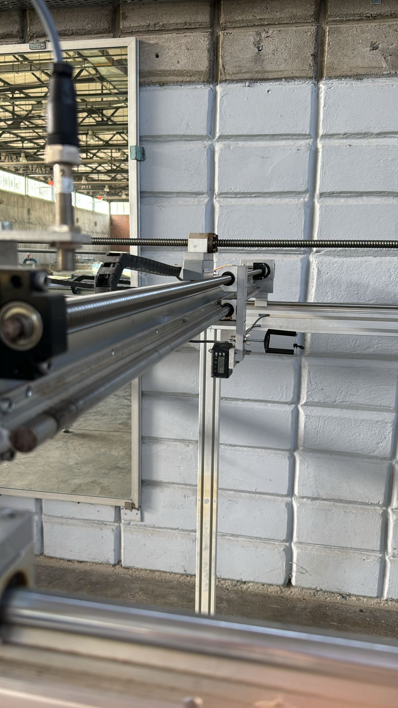
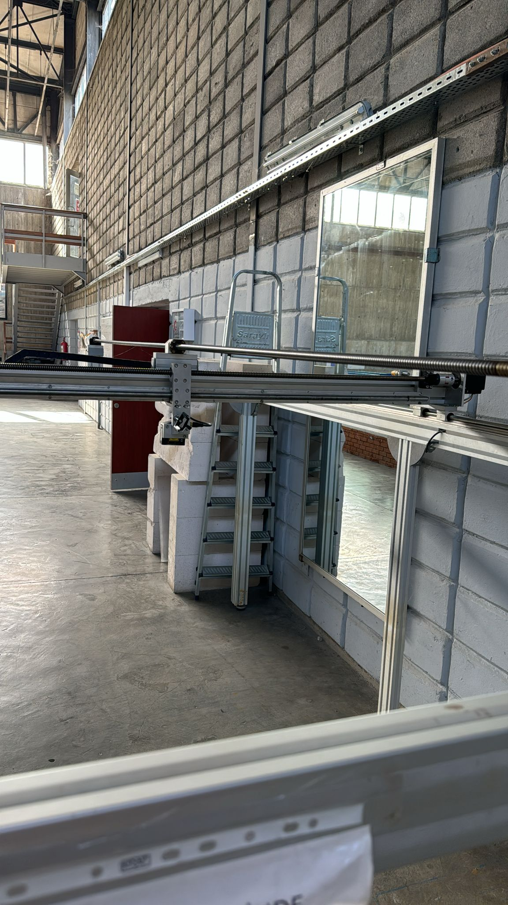
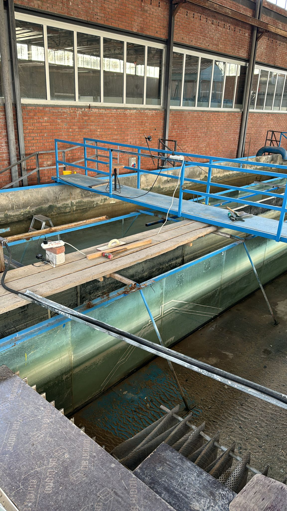

# LaserScanner
Codes related to the surface scanner for Coastal and Ocean Engineering lab - METU

# requirements
pip install pyinstaller numpy==1.15.4 pymodbus==2.2.0
# conversion
pyinstaller --onefile .\main.py 

## Automation panel

## Mechanical system

## Axes

## Experiment area

